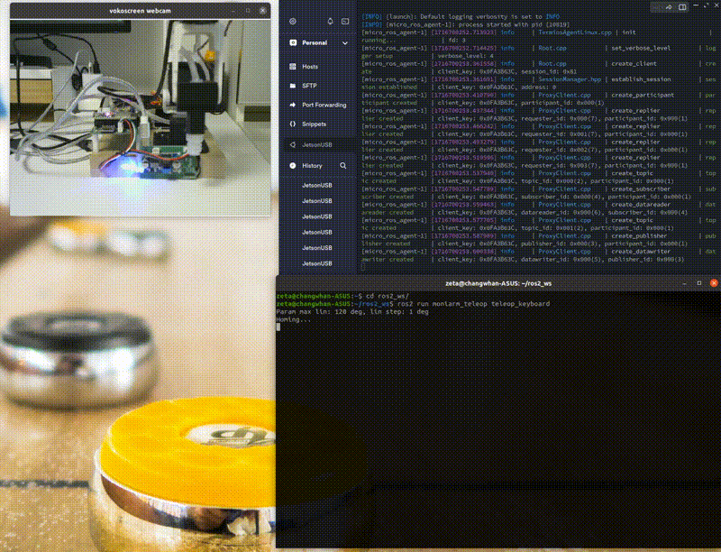
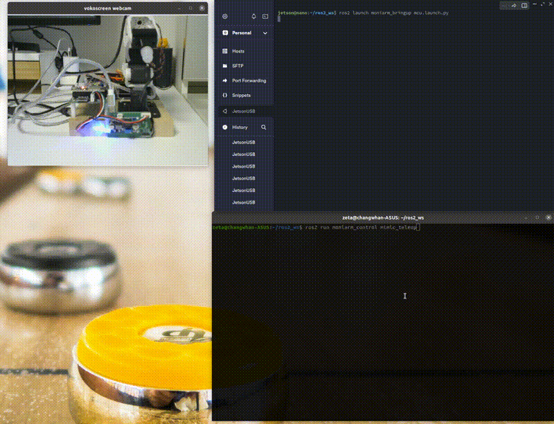
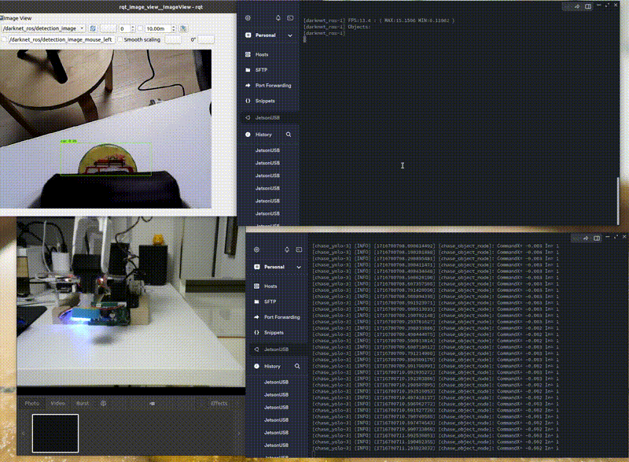

# rebearm: 5DoF + 1 Gripper/AirPump DIY Arm
**This project is about ROS2 Package for Robot Arm**  
Robot 3D model, BOM: Byungki    
Circuit: Byungki, ZETA7      
ROS code: ZETA7   

## !!! Under construnction!!! ## 

## Test System information
Rasberry Pi5     
X86 64bit Laptop(Asus Zenbook)   
* Ubuntu 24.04   
* ROS2 Jazzy   

## Packages with Brief Explanation

```
├── Doc                   => command list
├── Images                => Image for this README
├── rebearm_bringup       => robot bringup, start micro ros agent
├── rebearm_control       => Control DIY Robot Arm
├── rebearm_cv            => Computer Vision Package
├── rebearm_description   => Show robot model
├── rebearm_ml            => AI/ML
├── rebearm_teleop        => Teleoperation by human
├── rebearm_yolo          => Start Yolo for object detection
(...)
├── script                => configure buslinker, camera
```

# Especially Thanks
OMO R1 Mini: https://github.com/omorobot/omo_r1mini-foxy  
Other Open Source sites  

### rebearm, it uses buslinker v2
create_udev_rules_buslinker2.sh, delete_udev_rules_buslinker2.sh
  udev rule for buslinker v2
```
### rebearm, it uses fit0701 camera
create_udev_rules_fit0701.sh, delete_udev_rules_fit0701.sh
  udev rule for fit0701
```

There's Notion page, please visit here to get latest information   
But, It's written in Korean. Anyway, Here's the link   
TBD

## Installation
Please download Ubuntu image from below location   
TBD

```bash
id: pi
passwd: ubuntu
```

### **Verify USB camera**  
Control Robot Arm with gamepad/jostick  
<p align="center">
    
</p>

```bash
cd {$workspace_path}
# RPi5 , terminal #1
$ ros2 launch rebearm_cv usbcam.launch.py

$ ros2 run rqt_image_view rqt_image_view
# or
$ ros2 run image_view image_view --ros-args --remap /image:=/image_raw
```

### **Play with joystick**  
Control Robot Arm with gamepad/jostick  
<p align="center">
    
</p>

```bash
cd {$workspace_path}
$ ros2 launch monicar2_teleop joy_all.launch.py

Left lever left/right:  Base(M1), left/light
Left lever up/down:     shoulder(M2) move
Right lever up/down:    Elbow(M3) move
Right lever left/right: Wrist(M4) move

X   : gripper open/close toggle
L-1 : 90 position, motor assemble check
L-2 : Move home
R-2 : zero position, motor assemble check
```

### **Play with keyboard**  
Control Robot Arm with keyboard  
<p align="center">
    
</p>

```bash
cd {$workspace_path}
$ ros2 run rebearm_teleop teleop_keyboard

a/d : base(M1), left/light
w/x : shoulder(M2) move
j/l : Elbow(M3) move
i/, : Wrist(M4) move
g/G : Gripper close/open
h   : Move home
9   : 90 position, motor assemble check
z   : zero position, motor assemble check
```

### **Mimic teleop**  
Autonomous move for mimicing human operation
<p align="center">
    
</p>

```bash
cd {$workspace_path}
$ ros2 run rebearm_control mimic_teleop
```

### **Blob pick and plance**  
Find the any color box of the RPi5 Nano on the screen. then pick it then place  
<p align="center">
    
</p>

```bash
$ ros2 launch rebearm_control blob_all.launch.py
```

### **Yolo pick and place**  
Find the object of the RPi5 Nano on the screen, pick it then place  
<p align="center">
    
</p>

```bash
#terminal #1, #object detect using Yolo_v4
$ ros2 launch darknet_ros yolov8-rebearm.launch.py

#terminal #2,camera publish, object -> start or stop
$ ros2 launch rebearm_control yolo_all.launch.py
```

### **state publisher -> robot**  
joint_states publisher -> Move robot arm accordingly, TBD  
<p align="center">
    
</p>

```bash
$ ros2 launch rebearm_control state_all.launch.py
```

### **Blob pick and place with Deep Learning**
neural network -> Move robot arm accordingly
<p align="center">
    
</p>

```bash
#terminal #1, RPi5
$ ros2 launch rebearm_control blob_getdata.launch.py
#terminal #2, Laptop
$ ros2 launch rebearm_ml blob_nn.launch.py
```

### **Yolo pick and place with Deep Learning**
neural network -> Move robot arm accordingly
<p align="center">
    
</p>

```bash
#terminal #1, RPi5
$ ros2 launch rebearm_control yolo_getdata.launch.py 
#terminal #2, Laptop
$ ros2 launch rebearm_ml yolo_nn.launch.py
```
