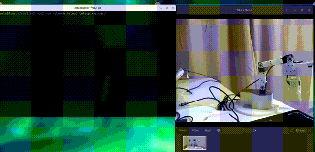
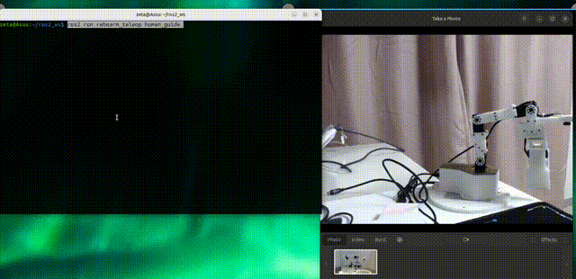

# Rebearm: 5DoF + 1 Gripper/AirPump robot Arm
**This project is about ROS2 Package for Robot Arm**  
Robot 3D model, BOM: Byungki    
Circuit: Byungki, ZETA7      
ROS: ZETA7   

<p align="center">
    
</p>

<p align="center">
    
</p>

## Test System   
RasberryPi 5     
X86 64bit Laptop(Asus Zenbook)   
* Ubuntu 24.04   
* ROS2 Jazzy   

## Packages with brief explanation

```
├── Doc                   => command list
├── Images                => Image for this README
├── rebearm               => package information
├── rebearm_control       => Robot arm control node
├── rebearm_cv            => Computer Vision Package
├── rebearm_description   => Show robot model
├── rebearm_interfaces    => Custom Msg 
├── rebearm_ml            => Control with ML
├── rebearm_moveit        => Moveit2
├── rebearm_teleop        => Teleoperation by human
├── rebearm_yolo          => Start Yolo for object detection
├── script                => configure buslinker, camera
```

# Especially thanks
Claude AI   
OMO R1 Mini: https://github.com/omorobot/omo_r1mini-foxy     
maximkulkin: https://github.com/maximkulkin/lewansoul-lx16a   
ethanlipson: https://github.com/ethanlipson/PyLX-16A   
Other Open Source sites  

## Brief Information for custom Pi5 image
Please download Ubuntu image for Rasberry Pi5 from below location   
https://drive.google.com/file/d/11r4C_iCkUGFboZejV6Kft2RQPGc3pGVT/view?usp=drive_link   
```bash
id: pi
passwd: ubuntu
```

# Preparation before arm operation
### rebearm, it uses buslinker v2   
create_udev_rules_buslinker2.sh, delete_udev_rules_buslinker2.sh, buslinker2.rules
```
$ cd ~/ros2_ws/src/rebearm/script/
$ ./create_udev_rules_buslinker2.sh
```
### rebearm, it uses fit0701 or daiso camera   
create_udev_rules_fit0701.sh, delete_udev_rules_fit0701.sh, fit0701.rules
```
$ cd ~/ros2_ws/src/rebearm/script/
$ ./create_udev_rules_fit0701.sh
# or
./create_udev_rules_daiso.sh
```

### **Verify USB camera**  
Check whether camera is working
<p align="center">
    
</p>

```bash
$ cd ~/ros2_ws
#  terminal #1
$ ros2 launch rebearm_cv usbcam.launch.py
#  terminal #2  
$ ros2 run rqt_image_view rqt_image_view
# or
$ ros2 run image_view image_view --ros-args --remap /image:=/image_raw
```

### **Play with joystick**  
Control Robot Arm with gamepad/jostick  
<p align="center">
    
</p>

```bash
$ cd ~/ros2_ws   
$ ros2 launch monicar2_teleop joy_all.launch.py

Left lever left/right:    Waist(M1), left/light
Right lever left/right:   Wrist(M5) move 
Right lever up/down:      Shoulder(M2) move
L1 + Right lever up/down: Elbow(M3) move
L2 + Right lever up/down: Forearm(M4) move
X   :                     gripper toggle
START :                   Move Home
```

### **Play with keyboard**  
Control Robot Arm with keyboard  
<p align="center">
    
</p>

```bash
$ cd ~/ros2_ws   
$ ros2 run rebearm_teleop teleop_keyboard

a/d : Waist(M1), left/light
w/x : Soulder(M2) move
i/, : Elbow(M3) move
I/< : Forearm(M4) move
j/l : wrist(M5) move
g/G : Gripper move
h   : Move home

### --ros-args -p do_calib:=1 parameter required ###
9   : 90 position, motor assemble check
z   : zero position, motor assemble check
```

### **Human guide**  
Make angle list by human operation while arm is torgue off
<p align="center">
    
</p>   

```bash
$ cd ~/ros2_ws   
$ ros2 run rebearm_teleop human_guide
```

### **Mimic teleop online or offline**  
Autonomous move for mimicing human operation
1. Mimic offline
<p align="center">
    
</p>

```bash
$ cd ~/ros2_ws  
$ ros2 run rebearm_teleop mimic_offline
```

2. Mimic Online
```bash
$ cd ~/ros2_ws  
$ ros2 run rebearm_teleop mimic_online
```

3. Leader -> Follower, Human guide + Mimic online
<p align="center">
    
</p>

```bash
# PC
$ ros2 launch rebearm_description rebearm_description_only.launch.py
# Rebearm follower
$ ros2 run rebearm_teleop mimic_online --ros-args -p port:='/dev/ttyUSB0'
# Rebearm leader
$ ros2 run rebearm_teleop human_guide --ros-args -p port:='/dev/ttyUSB1'
```

### **Blob pick and plance**  
Find the any color box from camera, then pick it up and place down   
<p align="center">
    
</p>

```bash
$ cd ~/ros2_ws  
$ ros2 launch rebearm_control blob_all.launch.py 
#or
$ ros2 launch rebearm_control blob_all.launch.py color:=green
```

### **Yolo pick and place**  
Find the object using Yolo11 from camera, then pick it up and place down
<p align="center">
    
</p>

```bash
$ cd ~/ros2_ws  
$ ros2 launch rebearm_control yolo_all.launch.py
```

### **Blob pick and place with Machine Learning**
Camera -> Blob, Y -> machine learning -> move robot arm
<p align="center">
    
</p>

```bash
$ cd ~/ros2_ws  
#terminal #1
$ ros2 launch rebearm_control blob_getdata.launch.py
#terminal #2
$ ros2 launch rebearm_ml blob_nn.launch.py
```

### **Yolo pick and place with Machine Learning**
Camera -> Yolo, Y -> machine learning -> move robot arm   
<p align="center">
    
</p>

```bash
$ cd ~/ros2_ws  
#terminal #1
$ ros2 launch rebearm_control yolo_getdata.launch.py 
#terminal #2
$ ros2 launch rebearm_ml yolo_nn.launch.py
```

### **state publisher -> robot in RVIZ**  
joint_states publisher GUI -> robot in rviz, ie simulation 
<p align="center">
    
</p>

```bash
$ cd ~/ros2_ws  
$ ros2 launch rebearm_description rebearm_description.launch.py
```

### **state publisher -> Real robot**  
joint_states publisher GUI -> real robot, not simulation 
<p align="center">
    
</p>

```bash
$ cd ~/ros2_ws  
$ ros2 launch rebearm_description state_all.launch.py
```

### **Moveit2**
robotic manipulation platform for ROS 2, TBD
<p align="center">
    
</p>

```bash
$ cd ~/ros2_ws  
#terminal #1
$ ros2 launch rebearm_moveit demo.launch.py 
```
